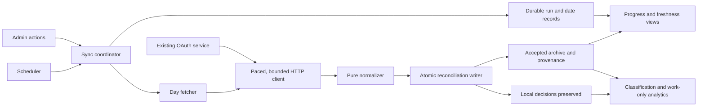
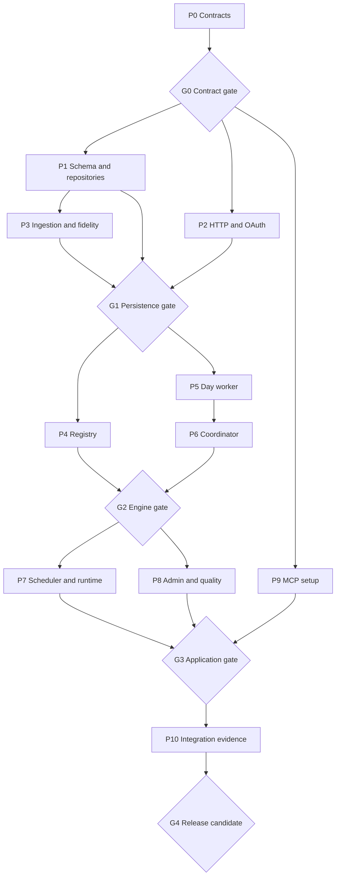

# Next milestone — dependable live archive and MCP setup

Status: implementation handoff prepared; implementation and release gates pending.
Reviewed: 2026-09-09. Repository baseline: `0376033` plus the existing working-tree changes.

This is the execution specification for the next milestone. It supersedes the
earlier draft of this file and the prospective sync design in
[IMPLEMENTATION-PLAN.md §7.3–7.4](./IMPLEMENTATION-PLAN.md#73-incremental-sync-policy).
It does not claim that background sync is already implemented.

**Outcome:** keep the archive current, preserve local classification decisions,
show what data is actually available, and give the operator working connection
instructions for MCP clients.

**Recommended design:** one application-owned sync coordinator, durable SQLite
work records, a pure day normalizer, and an atomic reconciliation writer.
Treat API observations, accepted archive data, and local decisions as separate
concerns. A timer requests work; it never owns a second ingestion path.

Read this document in order for design review. For dispatch, use §7–9.
The evidence-backed assessment of the original draft is in
[NEXT-MILESTONE-REVIEW.md](./NEXT-MILESTONE-REVIEW.md).

## 1. Scope and decisions

| Included in this milestone | Explicit boundary |
| --- | --- |
| MCP setup page for Codex, Claude Code, Claude Desktop remote connectors, and transport-level generic instructions | No universal client JSON format; no secret retrieval or key creation on this page |
| Manual recent sync, bounded backfill, cancellation, durable recovery | One Node application process owns execution; no distributed queue |
| Hourly, nightly, weekly comparison, and startup scheduling | Disabled initially; enabling is an operator setting |
| User-agent registry and authoritative editor labels | UUIDs remain rule values; missing mappings remain unresolved |
| Transactional reconciliation, provenance, fidelity, and freshness | Never calculate duration from heartbeats or spread aggregate seconds across files |
| Conservative operation when detail is missing | Successful HTTP responses do not automatically authorize replacing richer archive data |
| Admin progress and additive MCP quality metadata | Preserve work-only output and existing aggregate unclassified warnings |
| Production lifecycle and rollback documentation | No automatic deployment, upstream writes, or new OAuth scopes |

Defaults below are intentional implementation decisions. The orchestrator can
resolve routine naming and internal helpers without reopening the design.
Change a data-preservation or privacy invariant only through an explicit design
revision with its affected gates and tests updated.

### 1.1 What is already implemented

- `WakaTimeOAuthService` already has `getAccessToken()` and
  `refreshAccessToken()`, including early refresh and an in-flight refresh
  promise. Discovery already passes it as `tokenProvider`. Reuse it.
- `WakaTimeClient` has schema parsing and bounded retry counts, but lacks
  normal-request pacing, request/body deadlines, and cancellation propagation.
  Its current `Retry-After` handling can shorten upstream waits.
- `importDumps()` validates both files and writes them in one transaction.
  Its writer is insert-oriented; its additive conflict updates are unsuitable
  for repeat API polling. There are no `processDailyDay()` or
  `processHeartbeatDay()` functions.
- Classification is evaluated when queried. There is no materialized
  classification table that needs a new background reclassification engine.
- Sync tables and admin views exist, but their status constraints and view
  allowlists do not support the proposed lifecycle.
- `daily_time_allocations` references slices with `ON DELETE CASCADE`.
  A wholesale slice delete currently erases manual decisions.
- `server/index.mjs` imports the built SvelteKit handler. Runtime construction
  and migrations occur in the SvelteKit runtime; the custom server does not
  currently own a sync service.
- Existing local edits to the Classify page include the editable glob proposal
  field. Preserve them when adding editor labels and fidelity presentation.

## 2. Architecture and contracts

### 2.1 One path from request to committed day



Use dependency injection for the database, client, clock, delay, and cancellation.
Network I/O and sleeps must finish outside SQLite write transactions. Process
one date at a time, yielding to the event loop between dates.

Freeze these interfaces in P0; implementations may refine the fields without
changing the responsibilities:

```ts
type LayerResult<T> =
  | { kind: 'complete'; value: T; contentHash: string; observedAt: string }
  | { kind: 'restricted'; code: string; retryAt: string }
  | { kind: 'failed'; code: string; retryAt: string | null }
  | { kind: 'skipped'; reason: string };

type DayCandidate = {
  date: string;
  timezone: string;
  connectionGeneration: number;
  summaries: LayerResult<NormalizedSummaryDay>;
  heartbeats: LayerResult<NormalizedHeartbeatDay>;
};

type ReconcileResult = {
  disposition: 'updated' | 'unchanged' | 'preserved' | 'rejected';
  dayStatus: 'succeeded' | 'partial' | 'failed' | 'skipped';
  codes: string[];
};

interface SyncService {
  enqueue(input: RunRequest): Promise<{ runId: number; reused: boolean }>;
  cancel(runId: number): Promise<RunStatus>;
  start(): Promise<void>;
  stop(reason: 'shutdown', deadlineMs: number): Promise<void>;
}
```

`RunRequest` includes mode (`recent | backfill | compare | retry | registry`), trigger,
a validated inclusive date range or explicit retry dates, and an idempotency
key. The server selects timezone and connection generation. The browser cannot
supply a capability verdict, source hash, SQL selector, or upstream URL.

`NormalizedSummaryDay` records account totals, named project totals, optional
project/entity breakdowns, and explicit field-presence/completeness information.
`NormalizedHeartbeatDay` contains canonical events plus completeness evidence.
Unknown, missing, restricted, empty, and zero are distinct states. A registry
run has no date rows and stores its bounded refresh result separately; its
terminal outcome comes from atomic registry publication, not date aggregation.

### 2.2 API fidelity: do not pretend an API response is a dump

The official summary example has flat project totals; it does not establish
dump-style nested project entities. Heartbeat documentation also differs from
the local schema, including dependency representation, and does not establish
all identifiers required by the importer. The registry example does not prove
the pagination shape assumed locally. P0 must record these compatibility
boundaries in synthetic fixtures. [WakaTime API reference](https://wakatime.com/developers/)

Design for the documented baseline:

1. Preserve upstream representations and adapt them to a shared normalized
   model. Do not manufacture dump envelopes or silently default missing detail
   arrays to complete empty arrays.
2. A complete summary with project totals but no official entity seconds
   produces one explicitly typed `project_summary` slice per project.
   A day residual covers any positive difference from the account total.
   Use a dedicated slice kind and collision-proof internal identity; never
   masquerade as a file or overload the existing unattributed flag.
3. Coarse project slices are **unclassified by default**. They can receive an
   explicit whole-slice override in the admin UI, which clearly says the
   decision covers the entire project's time for that date. Do not apply a
   broad project rule to them while hiding unavailable finer distinctions.
   Automatic classification of coarse data is deferred.
4. Entity slices use existing rule precedence. If a changed summary lacks
   compatible heartbeat evidence and any enabled machine/editor rule could
   affect evaluation, conservatively leave non-overridden affected slices
   unclassified. Missing identity evidence must not cause a broader work rule
   to win by accident. A conservative global check for any enabled
   machine/editor rule is sufficient initially.
5. Do not attach a project's set of heartbeat machines/editors to its coarse
   duration slice. That does not establish how its seconds should be assigned.
   Do not reconstruct duration from heartbeat gaps, counts, or proportions.
6. Optional project-filtered summary fetches may supply finer data only if P0
   establishes their shape. Missing detail keeps the documented coarse
   behavior. No undocumented endpoint or automatic dump generation is required.
7. Unsupported heartbeat IDs, entity types, dependencies, or response envelopes
   fail that layer with a bounded compatibility code. Do not synthesize UUIDs,
   silently discard events, or claim complete evidence after filtering rows.

This is an explicit extension of the existing slice model, not a cosmetic
normalization adapter. Update types, classification previews, activity views,
allocation behavior, telemetry digests, and analytics together.

### 2.3 Reconciliation policy

`daily_totals`, dimensions, and duration slices form one coherent accepted
summary snapshot per date. Fetch status and accepted-data status are separate.

| Incoming observation | Accepted archive behavior | Recorded result |
| --- | --- | --- |
| Complete compatible summary, same normalized content | Keep stable data and slice IDs; update verification metadata | `unchanged` |
| Complete compatible summary, same or greater detail | Reconcile totals, scoped dimensions, and slices atomically | `updated` |
| Lower-detail summary against an existing richer day | Retain the entire accepted summary snapshot; retain the new observation for comparison | `preserved`, partial, `DETAIL_DOWNGRADE` |
| Missing requested date, incomplete body, invalid totals, or inconsistent timezone | Keep accepted data | `rejected`, failed with a safe code |
| Required summary restricted | Keep accepted data; record restriction and a retry date | `preserved`, skipped |
| Valid complete zero day at sufficient fidelity | Accept zero and retire absent slices while preserving their decisions | `updated` |
| Complete fresh heartbeats | Replace that date's active evidence membership; preserve archived raw variants | Layer success |
| Heartbeats unavailable or incompatible | Keep prior raw evidence and its original freshness; never label it newly synced | Layer degraded |

A flat zero result still counts as lower fidelity against an entity-level day
unless the response contract establishes authoritative complete deletion.
Never treat `data: []`, 402/403, omitted fields, or exhausted pagination as zero.

Compare fidelity by scope and field completeness, not a single numeric rank:
complete account/project totals plus complete entity detail for each retained
project must cover the previously accepted scopes. An explicitly removed project
can be retired only from a complete project set. P0 fixtures define that proof.
If a complete zero response cannot prove removal at the old detail level, retain
the old snapshot and report the discrepancy instead of guessing.

Build replacement sets before opening the transaction. Inside the transaction:

1. Recheck run cancellation, connection generation, source timezone, and accepted
   snapshot version. Abort stale candidates.
2. Record source lineage and changed payloads.
3. Upsert stable projects and slices by semantic identity. Assign incoming
   totals; never add a fresh poll's seconds onto existing totals.
4. Retire rows absent from a complete replacement; rebuild only the affected
   dimensions and identity associations.
5. Preserve and reconcile manual allocations as defined below.
6. Check mathematical invariants, advance accepted snapshot references and
   per-layer state, then complete the `sync_days` record in the same transaction.
7. Invalidate affected in-process identity caches after commit. Query-time
   classification reads the accepted snapshot and current rules.

A crash must expose either the old coherent day or the new coherent day.
Do not commit data first and mark the day successful in a later transaction.

**Numerical rule:** all duration values must be finite and nonnegative.
Use a shared 0.001-second comparison tolerance, matching allocation triggers.
Keep positive residuals even below one second. Reject negative residuals beyond
tolerance; never clamp away a material overcount. Do not sum overlapping
account/project dimensions. Check
`abs(sum(slices) - daily_total) <= 0.001` before accepting a day.

**Idempotency and provenance:** identify unchanged normalized content separately
from raw transport bytes and observation timestamps. Repeated polls must not
grow duration, dependency, or identity counts or invalidate previews merely by
renumbering identical slices. Reuse unchanged payload records; store new source
records for changed content and reference them from observations. Preserve
lossless activity payloads in the existing private source storage. Registry
metadata follows the smaller allowlist in §2.6.

### 2.4 Manual decisions survive source changes

Migrate allocations away from cascade deletion by the source slice. Keep their
stable IDs, semantic keys, classification, note, timesheet code, and audit history.

- Matching slice, changed duration: preserve the whole-slice decision, update
  `allocated_seconds` to the new official duration, and append a system
  reconciliation revision recording before/after values.
- Removed slice: mark the allocation detached. Preserve the last known amount
  as history; it contributes zero current time.
- Same semantic slice reappears: reattach its decision and audit the transition.
- Coarse-to-entity transition: detach a coarse override rather than distributing
  it among new entities. Show the decision for operator review.
- Never move a decision across dates, projects, entity identities, or slice kinds
  based on a guessed rename.

Keep strict duration validation for user-created or edited active allocations.
Detached rows need explicit state-aware constraints and UI/read-model handling.
Migration and writer tests must cover trigger behavior, detached allocations,
and append-only revisions. Extend revision enums and readers as necessary.

A sync commit that changes classification inputs must invalidate a previously
generated preview through the existing telemetry digest/revision mechanism.
An unchanged poll must leave that preview valid. Keep the current query-time
classification architecture; do not introduce a materialized result cache.

### 2.5 Evidence and freshness

Preserve historical heartbeat payloads and conflict variants. Introduce an
explicit active membership relation so reconciliation can stop using deleted
events without destroying provenance. Seed memberships from existing heartbeats
during migration, and make active-evidence readers honor membership.

Canonical event IDs and hashes provide deduplication across runs and sources.
Repeated observations must not inflate `observed_heartbeats`. A conflicting
payload for an existing ID is retained as a conflict observation and prevents
that heartbeat layer from becoming the accepted evidence snapshot; do not
silently replace its canonical payload.

Freshness is per date and per layer, with at least:

- last attempt, last successful observation, and last accepted change;
- accepted source reference, normalized hash, fidelity, and snapshot version;
- last status/code, next retry, and whether evidence matches accepted summaries.

Keep verified source timezone alongside these records. Fetch success must not
erase an older restriction/error or claim freshness for a different layer.
When new summary content is accepted without fresh compatible heartbeats, old
raw events remain inspectable as historical evidence; they cannot silently
supply current identity matches.

Use explicit freshness thresholds: two hours for today/yesterday, 26 hours for
the remaining dates in the 14-day reconciliation window, and eight days for
comparison of the preceding 90-day window. Older archive dates are historical,
not automatically overdue. An unresolved mismatch, failed due check, or detail
downgrade is stale regardless of age. A comparison only advances comparison
freshness; it does not verify entity or heartbeat fidelity. Today is provisional
until a successful check after its source-calendar day closes. Surface that
condition with the `CURRENT_DAY_PROVISIONAL` advisory code.

Admin views distinguish “updated,” “checked unchanged,” “archived detail
preserved,” “restricted,” and “needs reconnect.” They also distinguish “no data”
from a verified zero day.

MCP receives additive quality fields, bounded to the requested date/range:
`dataQuality` with `asOf`, `hasMissingDays`, `hasStaleDays`,
`hasLimitedDetail`, and allowlisted advisory codes. `asOf` is null when
coverage is incomplete; otherwise it is the oldest required summary verification
timestamp in the requested range. Coarse, preserved, and stale evidence conditions
must be visible without returning non-work identities, personal seconds, raw
upstream errors, account IDs, or registry data. A dump import is an archive
observation, not proof of a later API check.

### 2.6 User-agent registry

Persist the existing allowlisted identity metadata: canonical UUID, editor,
user-agent value, OS, version, AI model fields, application flags, and source
first/last-seen timestamps. Keep refresh timestamps distinct from source timestamps.

Stage an entire bounded refresh before publishing. Either publish all validated
pages in one transaction or retain the previous registry unchanged. Detect
repeated pages, duplicate conflicting IDs, invalid pagination, and exceeded
row/page/byte budgets. Partial success is not a successful refresh.

Historical mappings absent from a newer complete response remain available with
a historical marker; absence is not proof that a historical UUID never existed.
Refresh at most daily, including when scheduling first becomes enabled; allow
an explicit admin refresh. Registry failure does not block summary ingestion,
but registry behavior is a required milestone acceptance gate.

Resolve display names through the registry only. Show the friendly label with
a short UUID and make the full UUID accessible. Unknown IDs display “Unresolved
editor” and their UUID. Labels never become matching values, and refreshing
labels must not change classifications. Invalidate both editor and machine
identity caches correctly; the current `clearCaches()` only clears machines.

## 3. Execution, scheduling, and runtime

### 3.1 Durable lifecycle

Use these explicit states; update SQL constraints, TypeScript unions,
sanitizers, badges, and tests together:

| Record | States |
| --- | --- |
| Run | `queued → running → succeeded / partial / failed / cancelled / interrupted` |
| Date | `pending → running → succeeded / partial / failed / skipped / cancelled / interrupted` |
| Layer | `succeeded / failed / restricted / skipped` |
| Request kind | `recent / backfill / compare / retry / registry` |
| Existing trigger dimension | `manual / scheduled / startup / catchup` |

Persist a run and all its date records before responding to enqueue. Require an
idempotency key; replay of the same key and payload returns the original run,
and reuse with a different payload returns 409.

One coordinator runs one date at a time. Claim runs transactionally and enforce
at most one running run with a database constraint. Maintain a bounded queue
of ten nonterminal runs; a full queue returns 409 with `SYNC_QUEUE_FULL`.
Coalesce duplicate automatic intents. Select manual work before scheduled work
when claiming the next run; do not preempt a date transaction.

`cancel()` is idempotent. Queued runs become cancelled immediately. For an
active run, persist `cancel_requested_at` and abort any pending network read or
sleep. If a synchronous SQLite transaction has started, it completes atomically;
otherwise do not commit a new candidate after cancellation. Mark unstarted dates
cancelled. Cancellation after completion returns the existing terminal state.

Recovery runs before accepting new work: stale running runs/dates become
interrupted, accepted days stay committed, and unfinished eligible dates are
enqueued in a new run with `resumed_from_run_id`. Do not change a cancelled run
into retry work. Queued manual runs survive restart even when recurring
scheduling is disabled. Automatic recovery waits while scheduling is disabled.

Compute outcomes across **all dates**, not by handing repeated capability
results to `evaluateSyncRun()`, which selects the first summaries result:

- Explicit cancellation/interruption wins for the run lifecycle.
- All dates accepted or checked unchanged, with required detail/evidence
  expectations met: succeeded.
- Some useful acceptance/comparison, but any failure, restriction, fidelity
  preservation, or optional-layer degradation: partial.
- No useful result and an operational or baseline validation/auth failure: failed.
- All dates intentionally restricted/skipped: partial with `NO_DATES_UPDATED`;
  do not present it as success.

Progress counts come from durable date states: total, terminal, updated,
unchanged, partial, failed, skipped, cancelled, interrupted. Surface current date
and last progress timestamp. Do not use “days synced” as a synonym for attempts.

### 3.2 Capability policy and HTTP budget

Reuse `shouldAttempt()`, `shouldReprobe()`, and the existing sanitized error
types, extending policy with date-aware restriction information. These are
the actual API names; `shouldProbe()` and `evaluateRunOutcome()` do not exist.

An old date's 402/403 must not globally disable recent summaries or heartbeats.
Record restrictions on that date/layer; use a recent probe to establish an
endpoint-wide restriction. Scopes, endpoint access, and historical retention
are separate explanations. UI says “restricted” unless the cause is established.

Use one request gate for all requests owned by the application: summaries,
optional project details, heartbeats, registry pages, retries, and token refresh.
Minimum one second between request starts, one in-flight upstream request.
This is the application's conservative policy, not a newly asserted legal limit.
Acquire the dispatch permit after token acquisition so a refresh cannot deadlock
behind a data request holding the permit.

Honor the full upstream `Retry-After`; if it exceeds the current work budget,
persist a deferred retry and release the worker instead of shortening the wait.
Start with a 30-second whole-request deadline including body consumption and
a five-minute day budget. Keep existing bounded retry counts, jitter, and manual
redirect handling; all waits and body reads must be abortable. Bound each response
to 16 MiB, each staged day to 64 MiB, and registry refreshes to 100 pages/10,000
rows/16 MiB. Exceeding a limit preserves accepted data and returns an explicit code.

401 allows the existing one-refresh retry. A persistent auth failure blocks
further dispatch and requests reconnect. Distinguish transient refresh failure
from revoked authorization. Guard refresh persistence with a connection generation
so an old in-flight refresh cannot resurrect a disconnected/replaced connection.

A second CLI process does not share an in-memory gate. For this milestone,
document discovery and dump import as maintenance operations with the application
stopped, or reject them while its ownership lock is present. Do not claim
cross-process pacing based on a module singleton.

### 3.3 Source calendar, connection binding, and date selection

Source-day boundaries use the account timezone, never the server OS timezone
or `new Date().toISOString().slice(0, 10)`. Summary requests support timezone;
heartbeat documentation describes account-local dates without documenting the
same override. Verify returned boundaries rather than assuming a supported
query parameter. [WakaTime date semantics](https://wakatime.com/developers/)

Pin the archive timezone from the single imported account setting, or establish
it from summary range metadata for an empty archive. Verify unoverridden source
timezone and response boundaries before accepting the first run and after
reconnection. Existing imported daily rows may contain the default UTC even
when account settings contain another timezone: preserve their date keys and
repair metadata only when source provenance establishes the timezone.

A timezone mismatch pauses acceptance with `TIMEZONE_CHANGED`; do not silently
rebucket history. Use calendar arithmetic for dates and zoned scheduling for
wall-clock deadlines, including DST and year/leap-day boundaries.

The current OAuth connection does not store a verified account ID. Do not claim
account isolation that the schema cannot establish. Retain the single-account
scope and require the operator, when first binding sync to a populated archive
or reconnecting, to acknowledge that it is the same WakaTime account. Persist
that binding against a connection generation and archive identity; block
automatic writes after replacement until rebound. If upstream identity is
available within already granted scopes, verify it and reject a mismatch.
Adding the `email` scope or supporting account migration is outside this plan.

| Intent | Due time | Bounded work |
| --- | --- | --- |
| Recent | Hourly | Today and yesterday in source timezone |
| Reconcile | Daily at 03:00 source time | Previous 14 completed dates |
| Compare | Monday at 04:00 source time | Previous 90 completed dates; summary comparison only |
| Startup catch-up | Once after readiness/recovery | Recent coverage gaps and retryable dates since the durable watermark |
| Manual backfill | On request | At most 366 inclusive dates per run |

Weekly comparison uses bounded summary range requests, checks total/project
differences, and records mismatch codes. It never overwrites detailed days or
claims equal totals prove equal entity data. Normal reconciliation is a separate
intent; preserved-detail mismatches remain visible for a later dump import.

On first enable, seed recent seven-day coverage even when the archive is empty.
For startup selection, include missing rows **within** the coverage range,
retryable failures, and unfinished dates; `MAX(daily_totals.date)` is not a
coverage watermark. Dates successfully imported from a dump do not need an API
backfill solely because they lack `sync_days` rows. Recheck recent dates on cadence.

Order automatic work: today/yesterday, oldest uncovered dates in the recent
seven-day policy window, then older eligible gaps. Limit catch-up to 31 dates
per run, keep a durable cursor for remaining gaps, and yield between runs.
Known restricted dates wait for `next_retry_at`; do not hot-loop over old history.
Coalesce missed timer intervals into current intents instead of replaying every
missed hour. Store handled schedule slots/cursors as well as next due times.

### 3.4 Runtime ownership and shutdown

`createRuntime()` constructs services without starting timers or network calls.
Use SvelteKit's server `init` hook for explicit startup, guarded against build
and test execution. The documented hook runs when the server is created.
[SvelteKit hooks](https://svelte.dev/docs/kit/hooks#init)

Register a small process-local lifecycle handle with a stable
`Symbol.for('work-times.lifecycle')` key so the custom Node entry point can await
the **same** runtime's stop operation. Keep this bridge limited to start/stop
readiness, not access to tokens or arbitrary database operations. Do not import
source TypeScript or a generated, hashed SvelteKit chunk from `server/index.mjs`.

The production entry point waits for lifecycle readiness before listening.
Readiness means migrations, recovery, and service registration completed;
upstream availability must not prevent serving the admin reconnect page.
The build creates no timers and makes no WakaTime requests. Development uses
an explicit opt-in for scheduling with an isolated development database;
hot reload must not create duplicate coordinators.

On SIGTERM/SIGINT:

1. Stop accepting work, stop timers, and persist interruption intent.
2. Abort pending network operations and waits; finish or roll back the current
   synchronous transaction.
3. Mark the active run interrupted and preserve queued work.
4. Drain HTTP requests, close the shared database after consumers stop, then
   release process ownership.
5. Exit within 20 seconds; use a longer container stop grace period.

The custom server owns these steps; adapter-node's default-server shutdown
variables do not implement them for a custom handler host.
[SvelteKit custom server lifecycle](https://svelte.dev/docs/kit/adapter-node#Custom-server)

Support exactly one application process per database on a local Linux/macOS
filesystem. Use a nonblocking exclusive OS file lock on a stable sibling lock
file derived from the database's canonical path. Hold its descriptor for the
runtime lifetime; never unlink the lock file while processes may use it.
Acquire ownership before migrations/recovery and release it only after database
consumers stop. Maintenance CLIs must use the same lock. In-memory test databases
use an injected ownership implementation.

The default implementation is `fs-ext`'s `flock` with `exnb`; P0 verifies Node 24
and Docker build compatibility before selecting/pinning the dependency. This
adds one native dependency, justified by reliable process-death recovery without
an expiring lease. Network filesystems and multiple app owners are unsupported.
[fs-ext locking API](https://github.com/baudehlo/node-fs-ext)
A bare persistent `running` row is not a process-liveness test.

## 4. Schema and module ownership

The orchestrator owns migration numbering. Reserve the next available numbers
after rechecking the worktree; do not have two agents independently create 005.

| Migration responsibility | Required change |
| --- | --- |
| Durable sync state | Run/day lifecycle, request modes, idempotency, cancellation, recovery links, queue/claim constraints, accepted versus observed per-layer state |
| Reconciliation and overlay | Slice kind/identity constraints, allocation detachment and reconciliation history, active heartbeat membership, snapshot versions |
| Identity registry | Allowlisted registry, refresh generation/state, historical mapping retention |
| Connection lifecycle | Generation and archive binding; CAS on refreshed credential persistence |

Use versioned forward migrations, not edits to migrations 001–004. Rebuild
SQLite tables where CHECK/FK constraints require it; preserve IDs, child rows,
append-only history, indexes, and triggers. Test with foreign keys enabled under
the real migration runner, which wraps each migration in a transaction.
Do not rely on disabling `PRAGMA foreign_keys` inside that transaction.

Suggested modules (paths may be consolidated, ownership must remain explicit):

- `sync/contracts.ts`, `sync/calendar.ts`: shared types and pure date policies.
- `sync/repository.ts`: runs, dates, settings, freshness, and atomic claims.
- `wakatime/client.ts`, `wakatime/oauth.ts`: transport and credential lifecycle.
- `ingest/normalize-day.ts`, `ingest/reconcile-day.ts`: source-neutral model/writer.
- `sync/fetch-day.ts`, `sync/worker.ts`: fetch/normalize/commit orchestration.
- `sync/coordinator.ts`, `sync/scheduler.ts`: durable execution and schedule intents.
- `sync/user-agent-registry.ts`: bounded registry refresh.
- `runtime.ts`, `hooks.server.ts`, `server/index.mjs`: one lifecycle owner.
- Existing classification/analytics/admin readers: coherent fidelity and freshness.

Extract only reusable normalization, canonicalization, and writing concerns from
the importer. Keep `importDumps()` as its compatibility facade. Preserve dump
dry-run rollback, source-file hash no-op behavior, canonical conflict handling,
and original-fixture results. Newly imported overlapping dates must use the
same reconciliation safeguards; a repeat import must not erase live updates
merely because it is an older dump. If source recency cannot be established,
require an explicit maintenance replacement mode with a local preview.

## 5. Admin and MCP experience

### 5.1 Operational sync screen

Retain existing visual language, AppShell, reusable controls, and Svelte 5.
Organize the screen by operator decisions:

1. Connection readiness, scheduling toggle, source timezone, next due time,
   last successful accepted update, and concise degradation notice.
2. Primary “Sync now” action; secondary bounded backfill and compare actions.
3. Active/queued run with completed dates, current date, last progress,
   cancellation, and an honest “waiting for rate limit” state.
4. Run history; selected-run dates with layer status, disposition, freshness,
   safe diagnostics, and retry.
5. Registry last-refresh status and explicit refresh action.

Use JSON admin endpoints as the single mutation surface; page loads may call
the same read service. Do not build competing form-action business logic.

| Endpoint | Contract |
| --- | --- |
| `POST /api/admin/sync-runs` | Validate mode/range/idempotency; persist then return 202 with run ID and status URL |
| `GET /api/admin/sync-runs` | Bounded history plus service readiness and schedule state |
| `GET /api/admin/sync-runs/:id` | Run counters and paginated date results |
| `POST /api/admin/sync-runs/:id/cancel` | Idempotent cancellation; 404 for unknown run |
| `POST /api/admin/sync-runs/:id/retry` | New run from that run's failed/interrupted dates; record parent ID |
| `POST /api/admin/sync-settings` | Enable/disable scheduling and bind the current connection/archive |
| `POST /api/admin/sync-registry/refresh` | Enqueue a deduplicated, serialized registry refresh |

Single-date retry uses the run retry endpoint with a validated date belonging
to that run. Explicit retry may also target a restricted date once after a
reconnection; it does not enable an automatic restriction loop.

Require existing admin session, exact trusted Origin, and session CSRF token
for all browser mutations. No API-key or MCP token can control sync. Validate
calendar dates, ordering, future dates, enum fields, and maximum range; cap
pagination at 50 rows. Return structured allowlisted error codes. Sanitize at
persistence and response boundaries, not just by truncating arbitrary text.

Poll every two seconds while work is active, back off when idle/hidden, stop on
unmount, and prevent overlapping poll requests. Preserve date-picker input and
focus during updates. Show clipboard/poll errors accessibly. Polling is sufficient;
SSE is deferred.

### 5.2 MCP setup page

Add `/admin/mcp-config` between OAuth clients and Settings. Load the endpoint via
`new URL('/mcp', runtime.config.publicUrl).toString()`. Return only explicitly
selected key metadata; active means not revoked, not expired, and possessing
`activity:read`.

Present endpoint, client selector, authentication method, setup instructions,
copyable configuration, and a compact key-status section. Terminal styling
should use the existing dark palette, readable contrast, visible focus, and
horizontal scrolling inside code blocks on narrow screens. Copy exactly the
configuration text, announce success, and provide selectable text on failure.

Use these distinct client recipes:

| Client | Configuration |
| --- | --- |
| Codex | TOML `[mcp_servers.work-times]`, `url`, and `bearer_token_env_var = "WORK_TIMES_API_KEY"`; OAuth variant omits the bearer setting and uses `codex mcp login work-times` |
| Claude Code | `.mcp.json` with `mcpServers.work-times.type = "http"`, URL, and an Authorization header referencing `${WORK_TIMES_API_KEY}`; URL-only OAuth instructions include authenticating through `/mcp` |
| Claude Desktop remote connector | Connector settings and endpoint URL with OAuth; public reachability is required for the hosted connection |
| Generic client | Streamable HTTP endpoint and Bearer-header contract; client-specific syntax is deliberately not invented |

Codex uses TOML and supports a bearer environment variable.
[Official OpenAI MCP configuration](https://learn.chatgpt.com/docs/extend/mcp?surface=cli)
Claude Code documents HTTP configuration and environment expansion in
`.mcp.json`. [Claude Code MCP setup](https://code.claude.com/docs/en/mcp)
Claude Desktop's remote connector setup is separate from local desktop JSON,
and its remote connection originates from Anthropic infrastructure.
[Claude remote connectors](https://support.claude.com/en/articles/11175166-get-started-with-custom-connectors-using-remote-mcp)

The operator supplies the saved full application key in the client's environment;
a prefix cannot be expanded back into a secret. If the full key was lost, explain
how to create a replacement at the existing API-key page. API keys are optional
when using OAuth; never block the OAuth recipe with “create a key first.”

Do not accept a secret input, embed a live key, put it in localStorage, or expose
its hash. Render snippets as escaped text; use serialization appropriate to JSON,
TOML, and shell arguments. Do not interpolate upstream labels into commands.
Keep the WakaTime upstream OAuth connection distinct from Work Times MCP OAuth.

Include the existing reverse-proxy protocol-path guidance by linking to
OPERATIONS.md. Do not promise universal OAuth compatibility: verify at least one
URL-only client path and one bearer-token path at release.

## 6. Verification gates

Every package includes tests for its risks. Final verification is integration,
not the first time reconciliation or cancellation gets tested.

| Gate | Required evidence | Stop condition |
| --- | --- | --- |
| G0 — contracts settled | P0 contract/fixture matrix, schema/API types, lifecycle ownership choice, baseline results, and documented fallback for each unsupported upstream shape | Any consumer requires fabricated duration, identity, completeness, or an unspecified state |
| G1 — safe persistence | P1–P3 migrations and replay tests; dump compatibility; shared transport limits; allocation preservation; conservative coarse classification | Data loss, additive polling, invalid FK/trigger behavior, or widened work classification under missing evidence |
| G2 — durable engine | P4–P6: one date and range lifecycle, atomic progress, partial restrictions, registry publication, cancellation and crash recovery | Duplicate execution, false success/freshness, lost decisions, or a partially published registry |
| G3 — usable application | P7–P9: built-runtime lifecycle, scheduler calendar tests, secure operational UI, copyable recipes and quality metadata | Build-time network/timers, duplicate dev timers, missing auth/CSRF, misleading UI, or secret exposure |
| G4 — release candidate | P10 integration evidence, migration/backup/restore exercise, work-only MCP checks, browser review, and live compatibility result where available | Any unsatisfied invariant; explicitly report blocked external validation rather than claim release readiness |

Mandatory scenarios:

- Same day ingested twice: stable duration/identity/dependency counts and slice
  IDs; unchanged preview remains valid.
- A file disappears and another changes duration: decisions survive with
  auditable detachment/reconciliation; work totals use current official seconds.
- An old detailed dump day receives a flat API summary: accepted totals/slices
  stay coherent, no detail is erased, and the preservation warning is visible.
- New flat-summary day, mixed personal/work finer rules: no invented work
  attribution; a coarse override is visibly whole-project/day.
- Missing requested date versus valid complete zero; overcount and tiny positive
  residual; malformed or oversized response; unsupported heartbeat shape.
- Existing identity-based personal rule plus unavailable new heartbeat evidence:
  no fallback to a broader work rule.
- Fresh heartbeat membership removes upstream-deleted events from active
  evidence while historical raw variants survive; conflicts fail that layer.
- Summary accepted and optional evidence restricted; old-date restriction
  followed by successful recent fetch; all-restricted run is not “succeeded.”
- Registry failure on final page: old publication unchanged; successful refresh
  updates labels without changing UUID selectors or work/personal results.
- Concurrent enqueue, duplicate request, queue full, queued cancellation, active
  cancellation during body read/backoff, SIGTERM and hard process kill.
- Restart after commit but before loop advancement: date not double-counted.
- Missing OAuth, revoked token, transient refresh error, refresh concurrency,
  disconnect/reconnect during fetch, and connection-generation CAS.
- London spring/autumn DST, timezone mismatch, leap day, midnight rollover,
  long downtime, internal coverage gaps, and no archive.
- Build and unit tests create no scheduler or network activity; production boot
  registers exactly one owner before requests; second process rejected.
- All new admin writes enforce session/Origin/CSRF; run responses and logs omit
  private source strings and credentials even with malicious upstream fields.
- MCP summary/evidence after reconciliation include work-only data and bounded
  quality warnings; mixed-classification project breakdowns remain suppressed.
- MCP setup: active/expired/revoked/wrong-scope key states, no keys with OAuth,
  escaped URL, all copy controls, mobile/keyboard use, and clipboard failure.

Run `pnpm test`, `pnpm check`, and `pnpm build` at integration gates after
affected targeted tests pass. The repository has a `test:e2e` script but no
tracked Playwright configuration or browser specs at the reviewed baseline.
P8/P10 must add a small synthetic-data browser harness before claiming E2E
coverage; a script existing is not evidence of browser tests.

## 7. Work packages and ownership

Each package is one reviewable unit, not necessarily one commit or one agent turn.
“All tests pass” alone is not a handoff; attach the evidence named below.

| ID | Package / exclusive write ownership | Prerequisites | Deliverable and acceptance |
| --- | --- | --- | --- |
| P0 | Contracts and evidence; `sync/contracts.ts`, `sync/calendar.ts`, synthetic API fixture definitions, contract notes | None | Freeze source fidelity, types, status transitions, calendar helpers, limits, process-lock choice, endpoint DTOs, and schema migration specification. Establish G0. No production ingestion. |
| P1 | Schema and repositories; `migrations/`, DB repositories/schema, sync persistence, shared status allowlists | G0 | Forward migration from populated 001–004 DB, durable claims/progress, detached allocations, heartbeat memberships, registry and connection generation. FK/integrity/rollback tests. |
| P2 | HTTP/OAuth; `wakatime/client.ts`, `schemas.ts`, `oauth.ts`, errors and transport tests | G0 | Reuse token service; pacing, full Retry-After, deadlines, byte limits, cancellation, reconnect-safe refresh. Shared fake-clock/fetch tests. |
| P3 | Normalization, reconciliation, classification fidelity; `ingest/`, `import/`, classification model/service, base analytics changes | P1 | Pure adapters, source-safe writer, coarse slices, preserved decisions, current-evidence matching, digest behavior, unchanged dump fixtures. Establish persistence half of G1. |
| P4 | Registry; `sync/user-agent-registry.ts`, registry tests; editor cache integration in classification service | P1, P2, P3, G1 | Atomic publication and historical mappings, cache invalidation, unresolved fallback. P3 hands off shared classification file before P4 edits it. |
| P5 | Single-date worker; `sync/fetch-day.ts`, `sync/worker.ts`, capability policy and tests | P1, P2, P3, G1 | Fetch outside transactions, compatible candidate, atomic date result, per-date degradation, safe unchanged/preserved outcomes. |
| P6 | Coordinator; `sync/coordinator.ts`, run lifecycle and recovery tests | P1, P5 | Bounded durable queue, idempotency, aggregate outcomes, cancellation, recovery, single owner; reusable test service factory. |
| P7 | Scheduler and runtime; `scheduler.ts`, `runtime.ts`, `hooks.server.ts`, `server/index.mjs`, lifecycle tests | P4, P6, G2 | Source-calendar intents, catch-up cursor, readiness, ownership lock, build/dev guards, bounded shutdown. |
| P8 | Operational UI, endpoints, quality projection; `routes/api/admin/sync-*/`, admin sync/activity/classify views, admin readers, analytics/MCP quality DTOs | P4, P6, G2 | Complete secure control flow, polling, fidelity/decision presentation, bounded MCP quality metadata, synthetic browser harness. |
| P9 | MCP setup; `routes/admin/mcp-config/`, `AppShell.svelte`, snippet helper/tests | G0 | Correct per-client instructions and read-only safe key metadata. Independently reviewable. |
| P10 | Integration and release evidence; integration/browser/process tests, README/OPERATIONS/plan status | P7, P8, P9, G3 | G4 evidence bundle, staged rollout instructions, final limitations, no unsupported release claims. |

Shared-file rules:

- P1 owns SQL, shared persisted enums, and repositories throughout. Other agents
  request schema/API amendments through the orchestrator; no parallel migration
  edits or duplicate private repository implementations.
- P3 → P4 → P8 is the write order for `classification/sqlite.ts`. P8 owns final
  UI and quality integration after those owners hand off.
- P7 owns runtime/hooks/server. P8 supplies the required service API and calls
  it; it does not independently wire a second runtime or signal handler.
- P9 owns AppShell navigation; P8 does not modify it.
- Dependency/package/lockfile and cross-cutting export changes go through the
  orchestrator. Interfaces may be mocked before dependencies finish, but
  dependent packages cannot be marked accepted against mocks alone.

## 8. Dependency DAG and dispatch

Solid edges are completion prerequisites. Gates require the listed evidence,
not user approval for routine implementation work.



Equivalent adjacency list for unambiguous orchestration:

```yaml
P0: []
G0: [P0]
P1: [G0]
P2: [G0]
P9: [G0]
P3: [P1]
G1: [P1, P2, P3]
P4: [G1]
P5: [G1]
P6: [P5]
G2: [P4, P6]
P7: [G2]
P8: [G2]
G3: [P7, P8, P9]
P10: [G3]
G4: [P10]
```

Transitive prerequisites in the task table are intentionally collapsed in the
DAG. Expected critical path:
`P0 → P1 → P3 → P5 → P6 → P7/P8 → P10`.
P2 can become critical if API compatibility requires changes. The small MCP
page is a parallel early deliverable, not a reason to delay the risky foundations.

With three workers plus an orchestrator:

1. Complete P0 and review G0.
2. Dispatch P1, P2, P9 in parallel.
3. Start P3 as soon as P1 is accepted; review G1 when P2/P3 are complete.
4. Dispatch P4 and P5; start P6 after P5 without waiting unnecessarily for P4.
5. Review G2, then dispatch P7 and P8.
6. Review G3, complete P10, and evaluate G4.

Use available concurrency rather than requiring exactly three workers.
The orchestrator handles contracts, shared-file integration, and gate review;
workers stay within their package's write ownership.

## 9. Orchestrator handoff protocol

Before dispatch, inspect `git status`, current AGENTS.md instructions, migration
sequences, and this plan. Record the implementation baseline. Preserve user
changes; do not treat uncommitted files as disposable.

Create a small execution ledger recording package state
(`not_started | running | in_review | accepted | blocked`), owner, dependency
evidence, changed files/commit, checks, and outstanding issues. Gates are
`pending | passed | blocked`. Keep the DAG free of runtime scheduling details.

Each worker brief must contain:

- package ID, objective, prerequisites and their accepted interfaces;
- exact allowed paths and shared files it must not edit concurrently;
- relevant invariants and failure cases from §2–6;
- targeted checks and required handoff evidence;
- instruction to report schema/contract conflicts before inventing an alternative.

Each worker returns: changes, files, tests and results, any unverified behavior,
remaining limitations, and suggested integration order. The orchestrator
reviews the diff and verifies dependency contracts before marking acceptance.

If a gate fails, keep its dependents undispatched and assign the fix to the
owning package. Independent work continues. If live access is unavailable,
complete synthetic implementation and report live compatibility as pending;
do not fabricate a probe result or call the entire release verified.

## 10. Rollout and completion

1. Complete local G0–G3 using synthetic data and an isolated database.
2. Back up the target archive using the documented SQLite backup procedure.
   Verify a restored copy before migrating it.
3. Rehearse migration on that copy with scheduling disabled. Check counts,
   allocation IDs and detached state, audit history, foreign keys, and integrity.
4. Exercise a one-day manual sync against the intended connection, review the
   accepted-versus-observed diff, then run a seven-day reconciliation.
5. Validate a bearer MCP path and an OAuth MCP path against work-only fixtures
   or an appropriately isolated test instance.
6. Enable recurring sync after readiness/binding and successful manual
   verification. Observe at least one hourly run and force scheduler clock
   cases in tests; do not require a week of wall-clock waiting.
7. Update README/OPERATIONS and parent status to reflect actual shipped behavior,
   client verification, known limited detail, and the maintenance import procedure.

Operational rollback first disables scheduling and drains the coordinator.
For a code rollback incompatible with the new schema, stop the app and restore
the verified pre-migration backup with the matching old version. Explain that
post-backup observations/decisions require recovery before restoration; do not
silently discard them or attempt an untested down-migration.

The milestone is complete only when G4 passes. A passing synthetic suite with
an unavailable live endpoint is an implementation-complete candidate with an
explicit validation limitation, not proof that that integration works live.
